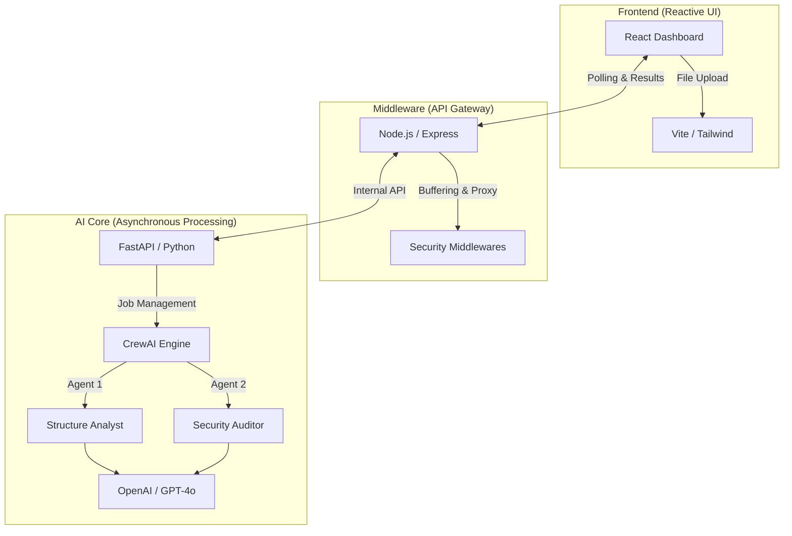

# 🛡️ Agentic Data Sentinel

[](https://github.com/CatsAndBatmanAndDeadpool/agentic-data-sentinel/actions/workflows/security-pipeline.yml)
[](https://img.shields.io/badge/Architecture-Microservices-blue.svg)
[](https://img.shields.io/badge/AI-CrewAI%20%2B%20OpenAI-purple.svg)

**Agentic Data Sentinel** is a smart tool that automatically "health-checks" your data files. It scans for hidden security risks (like leaked SSNs or emails) and cleans up structural mess before you feed the data into your AI models.

## 🎯 Project Context

This project was developed as a technical demonstration of building secure, human-in-the-loop AI data pipelines. It is specifically designed to showcase proficiency in **FastAPI**, **CrewAI**, and **DevSecOps** (SAST/DAST) in the context of advanced data evaluation platforms like DATAmundi's AIDA Hub.

## 🚀 Why use Agentic Data Sentinel?

If you work with data, you know the "Garbage In, Garbage Out" problem. Agentic Data Sentinel acts as a security gatekeeper:
- **Instant Security Scans**: Catches PII (Personally Identifiable Information) before it leaks.
- **Smart Cleanup**: Tells you exactly how to fix mixed data types and missing values.
- **AI-Powered Insights**: Uses a "Crew" of AI agents to think like a Data Engineer and Security Auditor.

## 📸 Dashboard Preview


*The professional tabular report provides a grouped, high-level overview of security and structural health.*

## 🏗️ Technical Architecture

Agentic Data Sentinel is built using a modern 3-tier microservices approach to ensure it is fast, secure, and scalable:



## 🛡️ Automated Security Pipeline (DevSecOps)

This project implements a full **DevSecOps Life Cycle**. Every time code is pushed to the `main` branch, an automated pipeline triggers to ensure maximum security:

- **SAST (Static Application Security Testing)**: Uses `Bandit` to scan Python code for potential vulnerabilities.
- **SCA (Software Composition Analysis)**: Uses `Safety` to check all dependencies for known security flaws.
- **DAST Placeholder**: A dedicated slot for Dynamic scans (like OWASP ZAP) to test the running API.
- **Automated Build**: Ensures the React frontend and local distributions are healthy.

### 🛠️ Technology Stack
| Layer | Technologies |
| :--- | :--- |
| **Frontend** | React 18, Tailwind CSS, Framer Motion, Lucide Icons |
| **API Gateway** | Node.js, Express, Multer, Helmet, CORS |
| **Backend AI** | Python 3.10+, FastAPI, Pandas, CrewAI |
| **Security/CI/CD** | GitHub Actions, Bandit, Safety, ShellCheck |

## 🌟 Key Features

- **Multi-Agent Orchestration**: Uses CrewAI to manage sequential tasks where Agent Outputs inform follow-up actions.
- **Secure-by-Design**: Node.js gateway enforces security headers and proxies internal microservices.
- **Professional UI/UX**: A glassmorphic dashboard with dynamic tabular reporting and merged sections.
- **Fail-Safe "Mock Mode"**: Includes a simulation engine for development without active OpenAI credits.

## 💻 Getting Started

### Prerequisites
- Node.js (v18+) & npm
- Python (3.9+) & venv
- OpenAI API Key (Optional; use `MOCK_AI=true` for simulation)

### ⚡ Quick Start (Setup Script)
```bash
chmod +x setup_project.sh
./setup_project.sh
```

---
*Created as a Portfolio Project by Sarang Kawade*
