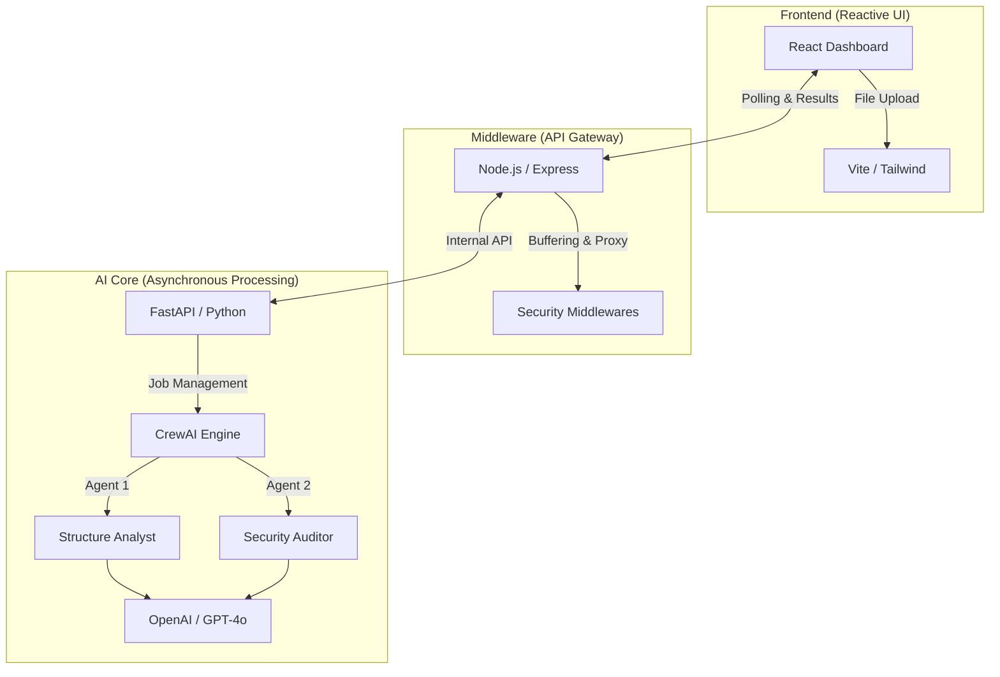

# 🛡️ Secure AI Data Evaluator (AIDA Lite)

[](https://img.shields.io/badge/Architecture-Microservices-blue.svg)
[](https://img.shields.io/badge/AI-CrewAI%20%2B%20OpenAI-purple.svg)
[](https://opensource.org/licenses/MIT)

**AIDA Lite** is a professional-grade, specialized AI data evaluation platform. It demonstrates modern full-stack engineering, multi-agent AI orchestration, and a security-first approach to data auditing.

## 🚀 The Value Proposition

Managing raw datasets is often a "black box" of PII risks and structural inconsistencies. AIDA Lite automates this by employing a **Crew** of specialized AI agents that execute a multi-step audit, providing a "Data Health Score" and a "Deep-Audit Table" for immediate developer action.

## 🏗️ Technical Architecture

The system follows a decoupled, 3-tier microservices architecture designed for scalability and separation of concerns:



### 🛠️ Technology Stack
| Layer | Technologies |
| :--- | :--- |
| **Frontend** | React 18, Tailwind CSS, Framer Motion, Lucide Icons |
| **API Gateway** | Node.js, Express, Multer, Helmet, CORS |
| **Backend AI** | Python 3.10+, FastAPI, Pandas, CrewAI |
| **AI/LLM** | OpenAI API (GPT-4o / GPT-4o-mini), Pydantic |

## 🌟 Key Features

- **Multi-Agent Orchestration**: Uses CrewAI to manage sequential tasks where Agent Outputs (Structure) inform follow-up tasks (Security).
- **Secure-by-Design**: Node.js gateway enforces security headers and proxies internal microservices to hide the AI core from direct public access.
- **Intelligent PII Detection**: Pattern-based and heuristic scanning for SSNs, emails, and sensitive keys.
- **Professional UI/UX**: A glassmorphic dashboard with smooth animations and dynamic tabular reporting with merged sections.
- **Fail-Safe "Mock Mode"**: Includes a dynamic Simulation engine for local development without active OpenAI credits.

## 🤖 AI Agent Responsibilities

1.  **Structure Analyst**: Validates schema consistency, identifies mixed data types, and recommends Primary Key candidates.
2.  **Security & Quality Auditor**: Scans for sensitive patterns, evaluates data density, and generates the final **Data Health Score**.

## 💻 Getting Started

### Prerequisites
- Node.js (v18+) & npm
- Python (3.9+) & venv
- OpenAI API Key (Optional; use `MOCK_AI=true` for simulation)

### ⚡ Quick Start (Setup Script)
We provide a unified setup script to configure all microservices:

```bash
chmod +x setup_project.sh
./setup_project.sh
```

### 🔧 Manual Configuration
1. **Python Backend**:
   - `cd backend-python && python3 -m venv venv && source venv/bin/activate`
   - `pip install -r requirements.txt`
   - Create `.env`: `OPENAI_API_KEY=sk-...` and `MOCK_AI=true` (if no key)
2. **Node Gateway**:
   - `cd backend-node && npm install`
3. **Frontend**:
   - `cd frontend && npm install`

---
*Created as a Portfolio Project by Sarang Kawade*
